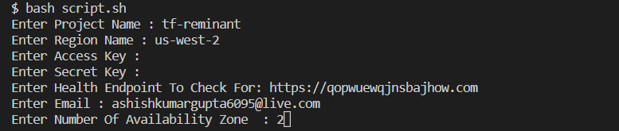
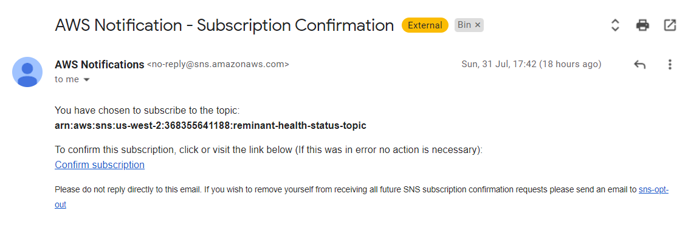
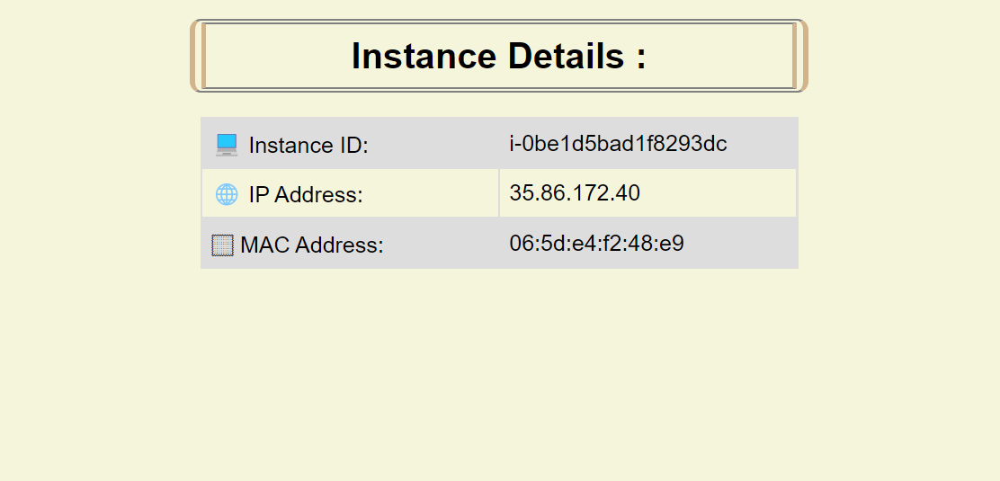
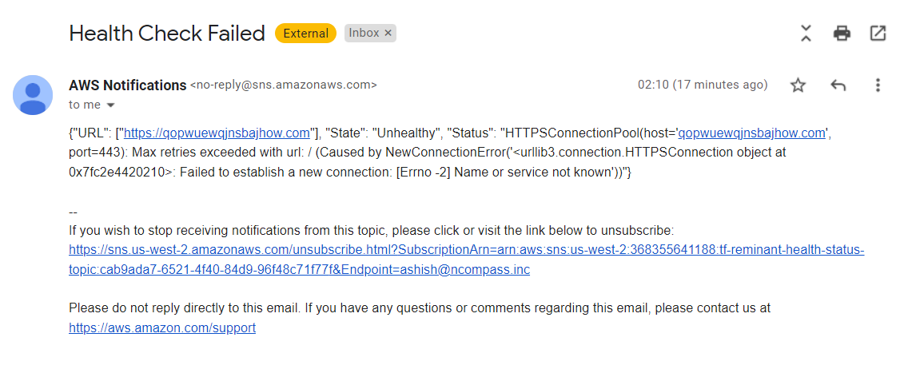

**Assignment**

### Table of Contents

- [Tasks](#tasks)
- [Setup](#setup)
- [Implementation](#implementation)
- [Outputs](#outputs)
- [Logs](#logs)

## Tasks

- Create an instance that serves a static website that displays the following details of the instance:
  - Instance ID
  - IP Address
  - MAC Address
- Create another instance that hosts a custom health check service that does the following:
  - Checks the health of any given endpoint based on the health check configuration
  - Alerts the team when the health check fails
- Automate the provisioning of above in a highly available environment using terraform:
  - Write the terraform code in such a manner that it can even be used by non-developers to replicate this setup in any AWS account/ region

## Setup
- Run bash script present in root directory.
  ```
  $ bash script.sh
  ```
- Enter required details.

  

- The deployment will start after user input. Wait for the deployment to complete.

- Confirm subscription for health check notification mails.

  

## Implementation
```To be documented```

## Outputs

- The following are the outputs after the services are up and running:<br><br>
  - ```Static Web:```<br><br>
  

  - ```Health Check Service:```<br><br>
  

<a></a>

## Logs

- **Deployment Logs:** Will be stored in ```deployment-log.txt``` file in project root directory.
<br><br>
Sample:
  ```json
  {"@level":"info","@message":"Terraform 1.2.6","@module":"terraform.ui","@timestamp":"2022-08-01T10:57:10.734132+05:30","terraform":"1.2.6","type":"version","ui":"1.0"}

  {"@level":"info","@message":"Plan: 26 to add, 0 to change, 0 to destroy.","@module":"terraform.ui","@timestamp":"2022-08-01T10:57:19.607729+05:30","changes":{"add":26,"change":0,"remove":0,"operation":"plan"},"type":"change_summary"}

  {"@level":"info","@message":"Apply complete! Resources: 26 added, 0 changed, 0 destroyed.","@module":"terraform.ui","@timestamp":"2022-08-01T11:00:18.483160+05:30","changes":{"add":26,"change":0,"remove":0,"operation":"apply"},"type":"change_summary"}
  ```

- **Output Logs:** Will be stored in ```output-log.txt``` file in project root directory.
<br><br>
Sample:
  ```
  ami_id = "ami-098e42ae54c764c35"
  priv_subnets_id = [
    "subnet-03f8daf7faff317a2",
    "subnet-0e3e025ac01bf02ee",
  ]
  pub_subnets_id = [
    "subnet-0245904f8321954aa",
    "subnet-05ccb18e79d0233bd",
  ]
  sns_topic_arn = "arn:aws:sns:us-west-2:368355641188:tf-reminant-health-status-topic"
  static_web_dns = "ec2-35-167-51-138.us-west-2.compute.amazonaws.com"
  static_web_ip = "35.167.51.138"
  vpc_id = "vpc-060bbaf921489412b"
  ```